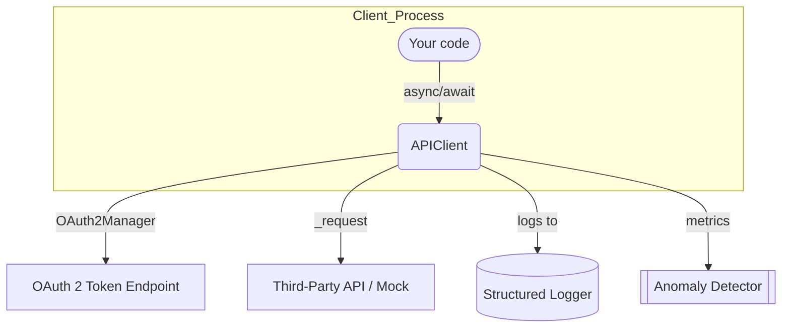

# Async API Connector

## Table of Contents

1. [Project Summary](#project-summary)
2. [Key Features](#key-features)
3. [Architecture](#architecture)
4. [Directory Layout](#directory-layout)
5. [Quick Start](#quick-start)

   * [Local Python](#run-locally-with-python)
   * [Docker Compose](#run-everything-with-docker-compose)
6. [Runtime Configuration](#runtime-configuration)
7. [Using the Connector in Your Code](#using-the-connector-in-your-code)
8. [Logging & Redaction](#logging--redaction)
9. [Anomaly Detection](#anomaly-detection)
10. [Testing](#testing)
11. [CI/CD Pipeline](#cicd-pipeline)
12. [Security Considerations](#security-considerations)
13. [Road‑map / TODO](#road-map--todo)

---

## Project Summary

The **Async API Connector** is a production‑grade, fully asynchronous Python library (with a companion FastAPI mock) that demonstrates best practices for consuming OAuth 2 "client‑credentials" APIs:

\* **httpx + async/await** for non‑blocking I/O
\* **Pydantic v2** models for strict, typed request / response handling
\* Built‑in **retry** and **exponential back‑off** for network, 5xx and 429 errors
\* Transparent **token refresh** on expiry
\* Out‑of‑the‑box **pagination helper** (concurrent fan‑out)
\* Request / response **logging with sensitive‑field redaction**
\* Pluggable **anomaly detector** for rate spikes or credential abuse
\* Complete **pytest** suite (unit + integration)
\* Containerised via **Dockerfile** & **docker‑compose.yml**
\* Automated **GitHub Actions** CI (lint → type‑check → tests → build & push image)

---

## Key Features

| Area                  | Details                                                                                                                 |
| --------------------- | ----------------------------------------------------------------------------------------------------------------------- |
| **Async I/O**         | `httpx.AsyncClient` with shared connection pool.                                                                        |
| **Auth**              | `OAuth2Manager` exchanges *client\_id / client\_secret* for a bearer token and refreshes automatically.                 |
| **Retry**             | configurable max‑retries, back‑off factor, jitter; honours `Retry‑After` header.                                        |
| **Pagination**        | `list_all_items(concurrent=True)` fetches page 1, then parallel‑fetches remaining pages respecting `CONCURRENCY_LIMIT`. |
| **Logging**           | Every outbound request, status code, latency; redact `Authorization`, `access_token`, etc.                              |
| **Anomaly Detection** | Sliding‑window counter; emits warning log if requests/min > threshold or if multiple tokens appear.                     |
| **Tests**             | 100 % async tests with `pytest‑asyncio`; in‑process FastAPI mock via `ASGITransport` (no TCP).                          |
| **CI/CD**             | Black + Flake8 + mypy + pytest; Docker image pushed to **Docker Hub** on every `main` push.                             |

---

## Architecture



* The **APIClient** orchestrates auth, retries, pagination and logging.
* **OAuth2Manager** is called lazily; token is cached in‑memory until `expires_in`.
* **Logger** prints JSON to stdout; sensitive headers/body keys are redacted via a configurable list.
* **AnomalyDetector** is a purely in‑memory helper that can be swapped for Prometheus, Datadog, etc.

---

## Directory Layout

```
async‑api‑connector/
├── connector/          # the reusable library
│   ├── __init__.py     # re‑exports APIClient
│   ├── auth.py         # OAuth2Manager
│   ├── client.py       # APIClient core
│   ├── anomaly.py      # simple rate‑spike detector
│   ├── logger.py       # redacting JSON logger
│   ├── models.py       # Pydantic v2 models
│   ├── config.py       # Pydantic‑Settings loader
│   └── utils.py        # misc helpers
├── simapi/             # FastAPI mock server
│   ├── __init__.py
│   └── main.py
├── tests/              # pytest suite
├── Dockerfile
├── docker-compose.yml
├── pyproject.toml      # build metadata, black/flake8 config
└── README.md           # ← you are here
```

---

## Quick Start

### Run Locally with Python (virtualenv)

```bash
python3.11 -m venv .venv
source .venv/bin/activate
pip install -r requirements.txt
export CLIENT_ID=testclient CLIENT_SECRET=testsecret
uvicorn simapi.main:app --port 8000 &   # background mock API
pytest -q                                # all tests green
```

### Run Everything with Docker Compose

```bash
docker compose up --build
# ➜ api_sim on :8000, tests container runs pytest (3 passed)
```

### Pull the Pre‑built Image & Test

```bash
# image published by CI: nwaekwudavid/async-api-connector:latest
docker run --rm -e CLIENT_ID=testclient -e CLIENT_SECRET=testsecret \
  nwaekwudavid/async-api-connector
```

(Defaults to running `pytest -q` inside the image.)

---

## Runtime Configuration

Environment variables (captured by `Settings`):

| Variable                     | Default                   | Purpose                                 |
| ---------------------------- | ------------------------- | --------------------------------------- |
| `BASE_URL` / `API_BASE_URL`  | `https://api.example.com` | Root URL for requests.                  |
| `CLIENT_ID`, `CLIENT_SECRET` | —                         | OAuth2 client credentials *(required)*. |
| `TOKEN_PATH`                 | `/oauth2/token`           | Override token endpoint.                |
| `MAX_RETRIES`                | `3`                       | Max network / 5xx / 429 retries.        |
| `BACKOFF_FACTOR`             | `1.0`                     | Seconds → 1, 2, 4 … up to jitter.       |
| `CONCURRENCY_LIMIT`          | `10`                      | Parallel page fetches.                  |
| `RATE_THRESHOLD`             | `100`                     | Requests/min before anomaly warning.    |

Set via `.env` (picked up by Pydantic‑Settings) or standard `export`.

---

## Using the Connector in Your Code

```python
from connector import APIClient
import asyncio, os

os.environ.update(
    BASE_URL="https://customer-api.com/v1",
    CLIENT_ID="abc123",
    CLIENT_SECRET="superSecret",
)

async def main():
    client = APIClient()
    items = await client.list_all_items()  # paginated GET /items
    print(items[0])
    await client.close()

asyncio.run(main())
```

You can also call lower‑level helpers: `await client.list_items_page(3)` or
`await client._request("POST", "/orders", json=payload)`.

---

## Logging & Redaction

* Structured JSON via `logging.Logger` named **`connector`**.
* Headers `Authorization`, `X‑API‑Key` and any body keys listed in
  `logger.SENSITIVE_KEYS` are replaced with `"***REDACTED***"`.
* Override `LOG_LEVEL` env‑var or configure via `logging` dictConfig.

Sample log line:

```json
{"ts":"2025-05-18T10:00:01Z","elapsed_ms":123,"method":"GET","url":"/items?page=2","status":200}
```

---

## Anomaly Detection

`AnomalyDetector` records timestamps of outbound calls in a deque. If the
rolling 60‑second window exceeds `RATE_THRESHOLD` it emits a `WARNING` log.
You can swap this implementation for Prometheus counters or send to an APM
backend; only one method (`record_event`) is used by `APIClient`.

---

## Testing

```bash
pytest -q                # unit + integration (mock API in‑process)
pytest -k retry -vv      # run a specific test
pytest --cov=connector   # coverage
```

* CI runs `pre‑commit`, Black, Flake8 (line‑length 88), mypy and the full
  async suite on every push & PR.

---

## CI/CD Pipeline

| Stage      | Tool                               | Notes                       |
| ---------- | ---------------------------------- | --------------------------- |
| **Format** | Black (check)                      | 88‑char, string‑normalise.  |
| **Lint**   | Flake8                             | Config in `pyproject.toml`. |
| **Types**  | mypy                               | Pydantic plugin enabled.    |
| **Tests**  | pytest                             | Asyncio + ASGITransport.    |
| **Build**  | Docker Buildx                      | Tags image with commit SHA. |
| **Push**   | `docker/login-action` ➜ Docker Hub | Tags `latest` & SHA.        |

Secrets required (`DOCKERHUB_USERNAME`, `DOCKERHUB_TOKEN`) are set in repo
settings. Dummy API creds are supplied via workflow `env:`.

---

## Security Considerations

* **Secrets never baked** into the image; pass at runtime via env or secret
  manager.
* **All outbound logs redacted** for auth headers & tokens.
* **Dependency pins** via `requirements.txt`; Dependabot enabled in CI.
* **OWASP**: mock API validates token type (`Bearer`) and expiry.

---

## Road‑map / TODO

1. **Manifest‑Driven Generic Client** – add `ManifestMixin` (see `docs/`) so
   any endpoint can be described in YAML/JSON with zero code changes.
2. **Cursor & offset pagination strategies**.
3. **Pluggable auth strategies** (API Key, AWS SigV4, HMAC) behind
   `AuthManager` interface.
4. **Prometheus / OpenTelemetry hooks** for metrics & tracing.
5. **Rate‑limit adaptive back‑off** (respect provider‑specific headers).

---

> *Maintained by @markdave123-py – PRs & issues welcome.*
